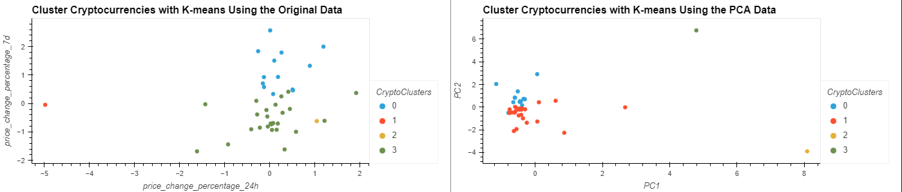

# crypto_clustering
Cluster the cryptocurrencies by their performance in different time periods and plot the results to visually show the performance.

The CSV file provided in the Resources directory contains the price change data of cryptocurrencies in different periods used for this analysis.

  
<b><u> Analysis using KMeans on Original data </u></b>

<b>Question:</b> What is the best value for k?

<b>Answer:</b> Based on this Elbow Curve, it looks like k=4 is the correct one.

  
<b><u> Optimize Clusters with Principal Component Analysis </b></u>

<b>Question:</b> What is the total explained variance of the three principal components?

<b>Answer:</b> About 89% of the total variance is condensed into the 3 PCA variables.

<b>Question: </b> What is the best value for k when using the PCA data?

<b>Answer: </b> Based on this Elbow Curve, it looks like k=4 is still the correct one using the PCA data.

<b>Question:</b> Does it differ from the best k value found using the original data?

<b>Answer:</b> No k value is found to be same for both PCA data and original data.

  
<b> Compare the elbow curve to find the best value for k with the original data and the PCA data</b>

  
<b> Cluster Cryptocurrencies with K-means Using the Original Data and PCA Data </b>

  

<b>Question: </b>After visually analyzing the cluster analysis results, what is the impact of using fewer features to cluster the data using K-Means?

<b>Answer: </b>It appears that the market segmentation of the crypto currencies information using the DataFrame with all of the factors yielded similar results that the PCA analysis. The data is grouped in clear customer segments in both cases.